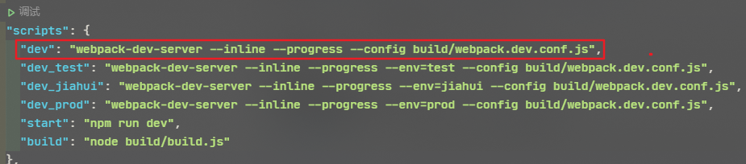
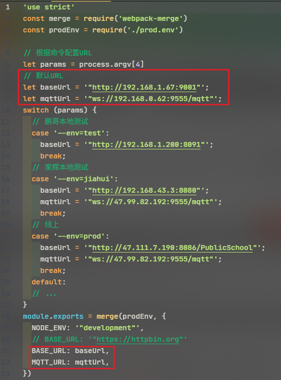
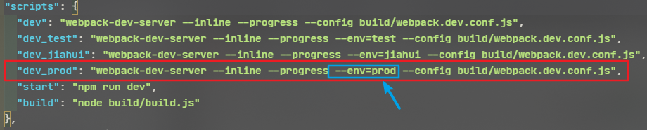
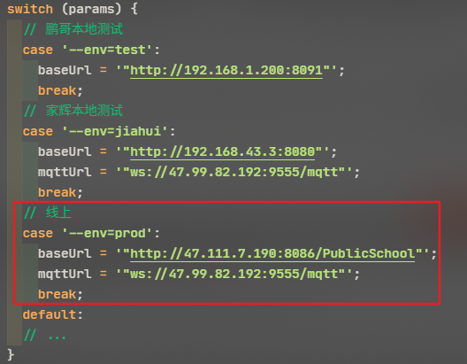
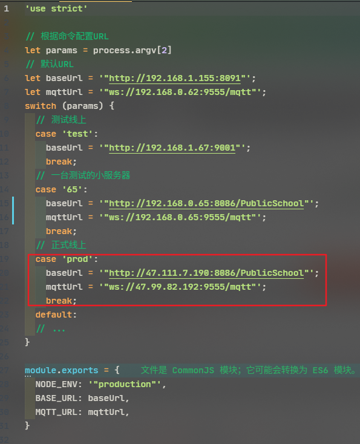

# 公立校项目
------------------------

#### 技术栈
vue2 + vuex + vue-router + webpack + ES6/7 + axios + elementUI + 阿里图标iconfont


#### 目录结构
------------------------

```bash
├── /build/          # 项目构建(webpack)相关配置
├── /config/         # 项目开发环境配置
├── /src/            # 源码目录
│ ├── /api/          # 请求接口
│ ├── /assets/       # 组件静态资源(图片)
│ ├── /components/   # 公共组件
│ ├── /router/       # 路由配置
│ ├── /vuex/         # vuex状态管理
│ ├── /views/        # 路由组件(页面维度)
│ ├── App.vue        # 组件入口
│ └── main.js        # 程序入口
├── .babelrc         # ES6语法编译配置
├── .editorconfig    # 定义代码格式
├── .eslintignore    # ES6规范忽略文件
├── .eslintrc.js     # ES6语法规范配置
├── .gitignore       # git忽略文件
├── index.html       # 页面入口
├── package.json     # 项目依赖
└── README.md        # 项目文档
```

#### 命名规范
**命名时要做到语义化**
- 组件名: 大驼峰
- class类名: 用 - 字符
- 方法名: 小驼峰
- 常量(const): 全部大写，用_分开
- 变量(let): 小驼峰
- 判断时用 === 或 !== 

##### 函数
命名方式：小驼峰式命名法。

命名规范：前缀应当为动词。

命名建议：语义化

动词|	含义|	返回值
--|--|--
can	|判断是否可执行某个动作(权限)|	函数返回一个布尔值。true：可执行；false：不可执行
has	|判断是否含有某个值	|函数返回一个布尔值。true：含有此值；false：不含有此值
is	|判断是否为某个值|	函数返回一个布尔值。true：为某个值；false：不为某个值
get	|获取某个值	|函数返回一个非布尔值
set	|设置某个值	|无返回值、返回是否设置成功或者返回链式对象
load|	加载某些数据|	无返回值或者返回是否加载完成的结果

#### git提交说明规范
type | 描述
--|--
add|增加
del|删除
mod|修改
update|更新
fix|修复bug
docs|文档（documentation）
style| 格式（不影响代码运行的变动）
refactor|重构（即不是新增功能，也不是修改bug的代码变动）
test|增加测试
chore|构建过程或辅助工具的变动
perf | 性能优化
revert | 撤销上一次的 commit
merge|合并分支操作

#### 使用数据共享
获取数据方法
```js
import { mapActions, mapState,mapMutations,mapGetters } from "vuex";

computed:{
  ...mapState(["role","id"]),
  ...mapGetters(["role","id"])
},
methods:{
  ...mapMutations(["addstudentlist"])
  ...mapActions(["addstudentlist"]),
}
// 如果想要获取操作其他module里的共享数据,例如teacher在数组前加上模块名即可
...mapState("teacher",["role","id"])
```


#### 运行项目
------------------------

**1.首次启动项目 加载项目所需依赖 必须先执行！！！**
```bash
npm install
```

**2.dev开发模式** 启动默认配置地址
> `package.json` 配置script



> `dev.env.js`



> 执行命令

```bash
npm run dev
```


**3.dev_prod开发模式** 添加--env=prod标识切换http及mqtt地址
- 补充说明：
- package.json中 添加标识 `--env=prod`
- dev.env.js中 添加`case "--env=prod":`
- 模板都写好了直接扩展就好了 这个应该会吧？
> `package.json`



> `dev.env.js`



```bash
npm run dev_prod
```

**4.build生产模式** 这个就是打包了 默认直接使用下面的命令即可
```bash
npm run build
```

**5.build prod生产环境** 针对打包环境给项目切换http与mqtt地址 与dev大同小异
- 补充说明：
- 不需要在package.json中配置任何信息
- 需要在prod.env.js中添加配置 case "prod":
- 相同 打包命令也需要加点东西 如下

> `prod.env.js`



```bash
npm run build prod
```